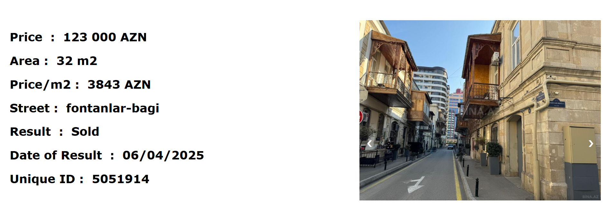
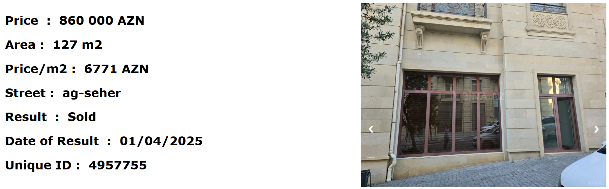

# BINA.AZ REAL-ESTATE SCRAPER (CS50 FINAL PROJECT) OVERVIEW

BINA.AZ is the biggest real-estate listing website in Azerbaijan. In this project, I analyze the most popular commercial streets/regions in the capital, Baku, in order to get a sense of the trends where the most real-estate  is bought and sold.

Utilizing libraries such as Selenium and BeautifulSoup, I parse/analyze the website and get the relevant data/photos  for all the listings in the relevant streets/regions and ultimately record them all into a local CSV database file.

From there, I filter through the CSV file to get only the listings that have potentially been sold. I further  process, clean, and filter the data to ultimately get only the sold listings which I then display on a simple 
website utilizing Flask.





# IMPORTANT NOTES
THIS IS WINDOWS ONLY IF YOU WANT TO USE TASK-SCHEDULER.

IMPORTANT: If you do use task-scheduler to run the scripts, windows might falsely claim you have a virus threat  when the scripts run. I do not know why it does that but it immediately says no threats detected once the  scripts have finished running.

IMPORTANT 2: Because the following code will download images of listings. Depending on how many of the sites you decide to scrape you could end up with close to 200MB worth of pictures. So I recommend you first try to manually run the code for one of the any given sites in "automate.py". More info below with the smallest example in final_vip.py section.

IMPORTANT 3: Stable internet connection is quite important.

# Requirements
```pip install -r requirements.txt```
<br>


# DOCUMENTATION
The following project has 4 main scripts.

In order of operations:
1) ###  final_vip.py  
2) ### update_sold.py (always run update_sold.py if you have done any manual changes before running flaskonius.py)
3) ### flaskonius.py  
4) ### automate.py (This is a one-time use script to automate tasks for the task-scheduler in Windows. Specifically, this will add 9 tasks where each will run "final_vip.py" for 1 of 9 given sites in automate.py. And it will also add "update_sold.py" as a task)


# FINAL_VIP.PY

For example, in VSCode, you can run:
```python final_vip.py https://bina.az/baki/port-baku/alqi-satqi/obyektler``` 
(this is the street/region with the least amount of listings thus the fastest)

Give it a minute or two to run. Make sure you have stable internet connection to avoid disruptions. If it errors out, 
just rerun the program. What makes it even trickier is that if you run it through 
task-scheduler and it errors out there, you won't know (you have to check to make sure "sold.csv" actually exists or rerun 
the task and the program should be instanteous if all listings were indeed checked on the website and all photos downloaded.
If it starts opening up listing websites means the program errored out due to a connection and will have to run again.)

This is the main script where data scraping, wrangling, and processing is done. It requires a URL link as a command line argument to function. 


You can find the URL links in the "automate.py" script. Each URL link will
contain all the listings for a given street or region in the capital of Azerbaijan, Baku. 

By the end of the script you will end up with 2 CSV files and many photo folders:
1) One is <mark>"sold.csv"</mark> and  
2) The other CSV file will be whatever the <mark>name of the street/region</mark> is in which the listings are located.  
3) The photo folders are named as the <mark>UNIQUE number ID</mark> of each listing and they will all be located WITHIN a folder that is named after the <mark>street/region</mark>.

sold.csv will only contain the listings that have been filtered as "potentially sold" from the "street/region.CSV" file.

 <mark>IMPORTANT</mark>: At the beginning sold.csv will be completely empty. You might have to wait 2-3 days for listings to start popping up in sold.csv. When you initially run the program all listings will satisfy "Days Passed" == "Days listed"(the criteria which should be violated for a listing to be considered "potentially sold". More explained in the comments in final_vip.py and update_sold.py) and thus no listings will end up being inserted in sold.csv. I have provided a mock "mock-sold.csv" so that you can run the code and test the program without having to wait for listings. Just rename "mock-sold.csv" to "sold.csv"(Get rid of any conflicting sold.csv files) 

Once this script will be tasked in task-scheduler it will run every twelve hours and overtime it will gather data.

You can also run it manually if you so wish as mentioned above.


# UPDATE_SOLD.PY

For this script you would just run it by itself without any command line arguments, i.e.  ```python update_sold.py```

Give it 2/3 minutes to run.
Make sure you have stable internet connection to avoid disruptions. If it errors out, just rerun the program. What makes it even trickier is that if you run it through task-scheduler and it errors out there you won't
know(you have to check to make sure "sold.csv" actually exists or rerun the task and the program should be instanteous if
all listings were indeed checked on the website and all photos downloaded. If it starts opening up listing websites means the program errored out due to a connection and will continue where it left off.)

Once sold.csv has been generated, we will have to clean the data as many listings in there will have either been "Expired" or "Renewed" (but not SOLD). So we must update sold.csv to indicate whether each listing has been sold, expired, or renewed, and then we will take the updated database and save it in a new file called <mark>"sold_update.csv"</mark>. This is where update_sold.py comes in.

This script will also double check to make sure that every listing in the database also has its respective photos as sometimes when the connection breaks the photo download/folder creation will be disrupted(This will lead to errors later on when trying to get the photos to display on the flask/HTML application)


Once this script is pushed to task-scheduler it too will run once every 12 hours(after the cycles of final_vip.py have finished running) and update the data

You can also run it manually if you so wish as mentioned above.

IMPORTANT: If you ever decide to manually enter potential listings into sold.csv. You absolutely must run update_sold.py before running flask. 


# FLASKONIUS.PY

Insert the following into the terminal in VSC :
```flask --app flaskonius run```

Finally, we can take all the "Sold" listings from "sold_update.csv" and once we have all the relevant data, we can upload the listings with the relevant info and photos onto a simple website made through Flask.

Or we can go to the "/all" to show all the listings in sold_update.csv


# AUTOMATE.PY

Insert the following into the terminal in VSC :
```python automate.py```

Depending on how your system accepts dates (dd/mm/yy) or (mm/dd/yy) you might have to tinker a little bit
within automate.py


FINAL NOTE: I have been running this code for the last 7 days. It took around 2 days for the first listings to pop up in sold.csv and from there on everyday listings would get added. So do not be alarmed if your sold.csv (and thus in turn your sold_update.csv) looks empty for the first few days after it runs through the cycles of scripts.
